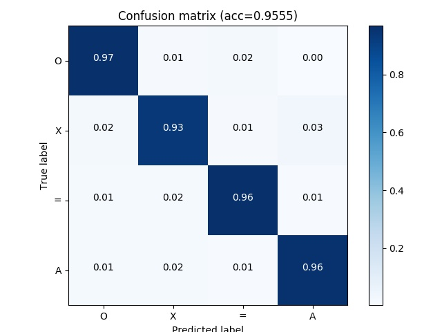

# keras-transfer-workflow

This project is motivated by quick invoke the transfer learning model with my own code convention. It's available to invoke these following model from keras

- `ResNet50`
- `Xception`
- `InceptionResNetV2`

So far, there's no proper way to add the custom layers, but you can refactor the model architecture in `src/models/<model>`

## Installing

First, clone this project and refer to [pipenv](https://github.com/pypa/pipenv) to confirm the package dependencies by the provided Pipfile.

```
$ git clone https://github.com/afunTW/keras-transfer-workflow
$ cd keras-transfer-workflow
$ pipenv shell
$ pipenv sync
```

Note that `pipenv shell` will load the Pipfile to build and enter the virtaulenv with the same python version defined in Pipfile.

If you don't have proper python version in your system, refer to [pyenv](https://github.com/pyenv/pyenv) and install the right version with the `pipenv --python <path/to/python>` command to create the virtualenv.

## Training

With my favorite debug tool [better_exceptions](https://github.com/Qix-/better-exceptions), you can simply enable this function before the python command. 

```
$ BETTER_EXCEPTIONS=1 python3 train.py \
--gpus 0 \
--train data/train \
--test data/val \
--name test \
--config config/default.json \
--backend resnet \
--comment "demo the transfer learning with resnet50 backend"
```

> note: train/ val data save in the following file structure `train/0`, `train/1/`, `train/2`, `train/3`, which the integer is the multiclass index

If you are going to check the `train.py`, there is some detail to know.

- custom loss `focal_loss`, check the `src/loss.py`
- available to extend the keras ImageDataGenerator, check the `src/preprocess.py`
- use tensorboard to visualize

### Get the data after training

According to the `--name` you provided in the python script, that will create a new folder `output/<name>` and it will contain the following files

- `config.json` record the parameter you set in `config/`
- `history.csv` record some value during training model
- `log.txt` record all message during training
    - python script paramters
    - model structure
    - model estimation for required GPU memory
    - total training time
- `<backend>.h5` is the model checkpoint
- `tensorboard/` record some file for running tensorboard

## Evaluate

Remember that the models we implement have different default input shape. Because of the image preprocessing and resizing, it's better to evaluate the same input shape model at the same time.

- ResNet `(224 224 3)` in `HWC`
- Xception `(299 299 3)` in `HWC`
- InceptionResNetV2 `(299 299 3)` in `HWC`

```
$ BETTER_EXCEPTIONS=1 python3 evaluate.py \
--gpus 0 \
--models output/test1/resnet.h5 output/test2/resnet.h5 \
--test data/test \
--input-shape 224 224 \
--focal-loss
```

> note: If you use the custom loss, you have to invoke the same loss function when you load model

After the evaluation, a process will generate y_pred.npy under the folder for each model we provided. Besides, the multiclass output will generate the `confusion_matrix.jpg`



## Ensemble

In order to improve the performance and enhanced the robustness, we can simply ensemble different model to predict the same target. There are different ensemble methods like boosting and stacking, but we simply apply the averaging and voting for the test output. Therefore, we have to run the `evaluate.py` script to generate `y_pred.npy` first, then run the `ensemble.py` to test if the performance rise.

```
# ensemble the given models
$ BETTER_EXCEPTIONS=1 python3 ensemble.py \
--method avg \
--ground-truth data/test \
--predictions output/test1/y_pred.npy output/test2/y_pred.npy
--predict-given
```

In another case, I do a lot experiment and generate a bunch of models and `y_pred.npy` under `output/` but have no idea what is the best combination. We can run the same `ensemble.py` script but given the output directory to test automatically and output the best-combined performance for each length (> 1)

```
# find the best ensemble combination
$ BETTER_EXCEPTIONS=1 python3 ensemble.py \
--method avg \
--ground-truth data/test \
--predictions-dir outputs \
--predict-all
```

e.g.

```
Limit len 02 - combination=['test09', 'test17'], acc=0.9635
Limit len 03 - combination=['test09', 'test14', 'test17'], acc=0.9683
Limit len 04 - combination=['test03', 'test09', 'test14', 'test17'], acc=0.9675
...
```

## Tensorboard

Visualize the progress of your experiment.

```
# e.g. </path/to/tensorboard> = output/test/tensorboard
$ tensorboard --logdir output/test/tensorboard/

# if you running tensorboard on a server, you can check the tensorboard on local by setting ssh tunnel
$ ssh -NfL 6006:localhost:6006 username@server
# open localhost:6006 in your local browser
```

## Reference

- [Deep Residual Learning for Image Recognition](https://arxiv.org/abs/1512.03385)
- [Xception: Deep Learning with Depthwise Separable Convolutions](https://arxiv.org/abs/1610.02357)
- [Inception-v4, Inception-ResNet and the Impact of Residual Connections on Learning](https://arxiv.org/abs/1602.07261)
- [Focal Loss for Dense Object Detection](https://arxiv.org/abs/1708.02002)